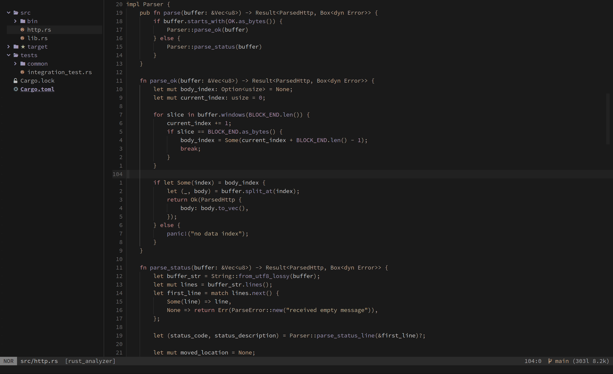
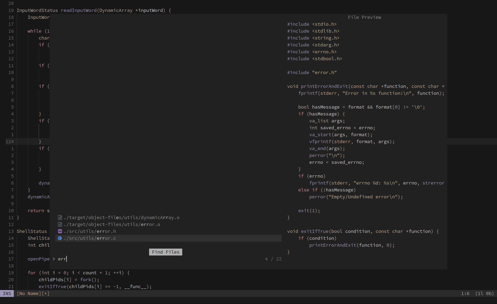
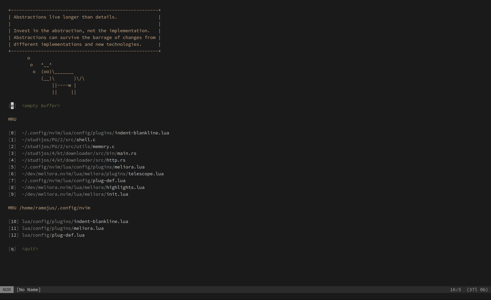
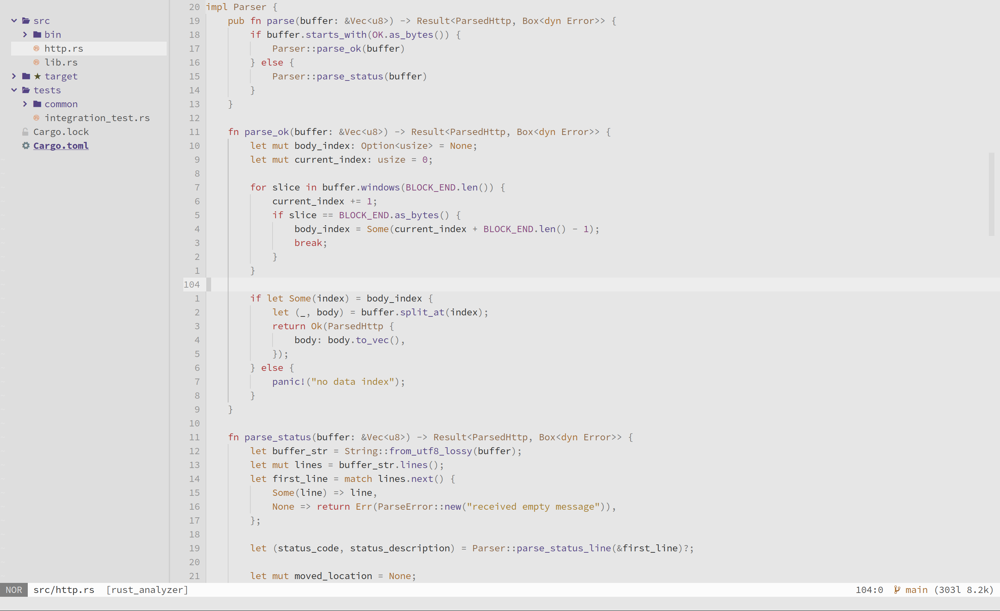

# Mellifluous colorscheme for [Neovim](https://github.com/neovim/neovim)
My own colorscheme. Smooth and productive, with stronger highlights on important keywords. Filled with honey.

Made with [lush](https://github.com/rktjmp/lush.nvim).

## Preview





## Styled plugins
- [Treesitter](https://github.com/nvim-treesitter/nvim-treesitter)
- [Native LSP](https://github.com/neovim/nvim-lspconfig)
- [Telescope](https://github.com/nvim-telescope/telescope.nvim)
- [NvimTree](https://github.com/kyazdani42/nvim-tree.lua)
- [Nvim-cmp](https://github.com/hrsh7th/nvim-cmp)
- [Indent Blankline](https://github.com/lukas-reineke/indent-blankline.nvim)
- [Startify](https://github.com/mhinz/vim-startify)

## Usage
When installing, [lush](https://github.com/rktjmp/lush.nvim) is required.
Example with [packer.nvim](https://github.com/wbthomason/packer.nvim):
```lua
use {
    'ramojus/mellifluous.nvim',
    requires = {'rktjmp/lush.nvim'}
}
```

## Configuration
Here is an example with the default config, change it as you like. If you like the defaults, there is no need to call `setup`.

```lua
require 'mellifluous'.setup({
    dim_inactive = false,
    color_set = 'mellifluous',
    styles = {
        comments = 'italic',
        conditionals = 'NONE',
        folds = 'NONE',
        loops = 'NONE',
        functions = 'NONE',
        keywords = 'NONE',
        strings = 'NONE',
        variables = 'NONE',
        numbers = 'NONE',
        booleans = 'NONE',
        properties = 'NONE',
        types = 'NONE',
        operators = 'NONE',
    },
    transparent_background = {
        enabled = false,
        floating_windows = false,
        telescope = true,
        file_tree = true,
        cursor_line = true,
        status_line = false,
    },
    plugins = {
        cmp = true,
        indent_blankline = true,
        nvim_tree = {
            enabled = true,
            show_root = false,
        },
        telescope = {
            enabled = true,
            nvchad_like = true,
        },
        startify = true,
    },
})
```

### Mixing styles
Set style value to `'style1 style2'`, for bold and italic it would be `'bold italic'`.

### Setting light theme
Set `vim.opt.background` to `'light'`. This will only work on color sets that have light theme.

### Color sets
Color sets are like different colorschemes, but they use the same highlight rules, so in this case, I find it more accurate to call them color sets.

I added alduin and mountain color sets (both non-original) mostly for nostalgia, these are my two most favorite colorschemes after mellifluous and I've been using each of them for about a year before creating mellifluous.

Non-original color sets are made to match their original version as closely as possible with the same highlight rules as mellifluous.

These color sets don't get loaded, unless you specify them in a `color_set` option, so there is no performance impact.

Available color sets:
- `mellifluous`
- `alduin`. Dark only. [link to original](https://github.com/alessandroyorba/alduin)
- `mountain`. Dark only. [link to original](https://github.com/mountain-theme/mountain)

#### Color set specific config options
##### Mellifluous
default config:

```lua
require 'mellifluous'.setup({
    mellifluous = {
      neutral = true, -- set this to false and bg_contrast to 'medium' for original mellifluous (then it was called meliora theme)
      bg_contrast = 'medium' -- options: 'soft', 'medium', 'hard'
    }
})
```

## CLI options
Type `:Mellifluous <TAB>` and see the available options.

Options include:
- Toggling transparency.
- Changing color set.

## TODO
- [x] Add color set specific options.
- [ ] Add vim help docs
- [ ] Add guidelines for how to create your own theme with the same highlight rules.
- [ ] Support more plugins (contributions are welcome).

## Mellifluous ports
- [Helix (with slightly outdated color palette)](https://github.com/helix-editor/helix/wiki/Themes#meliora)

## Mellifluous inspiration
Mellifluous color set is mostly inspired by these great themes:
- [Mountain and Mountaineer](https://github.com/mountain-theme/mountain)
- [Alduin](https://github.com/alessandroyorba/alduin)
- [Melange](https://github.com/savq/melange)
- [Sema](https://github.com/arzg/sema)

## License
[MIT](./LICENSE)
