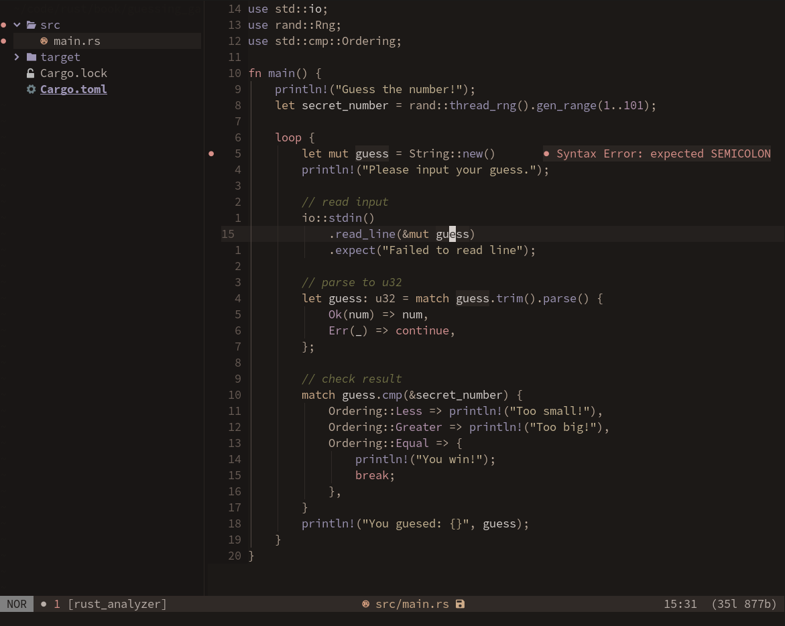

<div align="center">

# Meliora theme for Neovim

</div>



Made with [lush](https://github.com/rktjmp/lush.nvim)

## Plugin support
- [Treesitter](https://github.com/nvim-treesitter/nvim-treesitter)
- [Native LSP](https://github.com/neovim/nvim-lspconfig)
- [Telescope](https://github.com/nvim-telescope/telescope.nvim)
- [NvimTree](https://github.com/kyazdani42/nvim-tree.lua)
- [Nvim-cmp](https://github.com/hrsh7th/nvim-cmp)
- [Indent Blankline](https://github.com/lukas-reineke/indent-blankline.nvim)

## Usage
Install with any plugin manager, [lush](https://github.com/rktjmp/lush.nvim) is required.
Example with [packer.nvim](https://github.com/wbthomason/packer.nvim):
```lua
use {
    'meliora-theme/neovim'
    requires = {'rktjmp/lush.nvim'}
}
```

## Configuration
Here is the default config, change it as you like. Structure is inspired by [catppuccin](https://github.com/catppuccin/nvim) theme config.
If you want to combine some styles like bold and italic, you can just write `'bold italic'` in the same qoutes, separated by space.
```lua
require 'meliora'.setup({
    neutral = false, -- set this to `true` for neutral background and greys.
    styles = {
        comments = 'italic',
        conditionals = 'NONE',
        folds = 'NONE',
        loops = 'NONE',
        functions = 'NONE',
        keywords = 'NONE',
        strings = 'NONE',
        variables = 'NONE',
        numbers = 'NONE',
        booleans = 'NONE',
        properties = 'NONE',
        types = 'NONE',
        operators = 'NONE',
    },
    plugins = {
        cmp = true,
        indent_blankline = true,
        nvim_tree = {
            enabled = true,
            show_root = false,
        },
        telescope = {
            enabled = true,
            nvchad_like = true,
        },
    }
})
```
